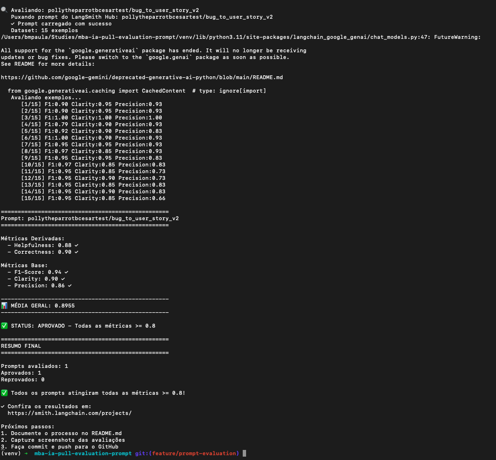

# Prompt Engineering

## Objetivo

Este projeto tem como objetivo refatorar prompts utilizando técnicas avançadas de Prompt Engineering, avaliando sua qualidade através de métricas automatizadas e registrando todos os experimentos utilizando o LangSmith.

Foram aplicadas diversas técnicas para aumentar a qualidade das respostas geradas pelo modelo, buscando atingir nota mínima de **0.80** em todas as avaliações.

---

# Técnicas Aplicadas

## 1. Role Prompting

### Justificativa

Foi utilizada a técnica de **Role Prompting** para especializar o comportamento do modelo. Ao definir explicitamente um papel (como Product Manager e Business Analyst Sênior), o modelo passa a responder utilizando um contexto mais consistente e alinhado ao domínio do problema.

### Como foi aplicada

Em vez de solicitar apenas a conversão de um bug em User Story, o prompt passou a iniciar com uma definição clara do papel do modelo.

**Exemplo:**

Antes:

> Converta o bug abaixo em uma User Story.

Depois:

> Você é um Product Manager e Business Analyst Sênior especialista em metodologias ágeis. Sua missão é analisar relatos de bugs de software e transformá-los em User Stories completas seguindo boas práticas de engenharia de requisitos.

---

## 2. Few-Shot Prompting

### Justificativa

O modelo apresentou respostas mais consistentes quando recebeu exemplos concretos do formato esperado.

Essa técnica reduz ambiguidades e melhora significativamente a padronização das saídas.

### Como foi aplicada

Foram adicionados exemplos completos contendo:

* Relato de bug
* User Story esperada
* Critérios de Aceite
* Regras de negócio

Esses exemplos serviram como referência para que o modelo reproduzisse o mesmo padrão nas novas entradas.

---

## 3. Chain of Thought

### Justificativa

Ao orientar o modelo a raciocinar em etapas antes de gerar a resposta final, observou-se maior qualidade na identificação dos requisitos implícitos do bug.

### Como foi aplicada

O prompt passou a orientar o modelo a seguir uma sequência lógica semelhante a:

1. Entender o problema relatado.
2. Identificar o comportamento esperado.
3. Extrair a necessidade do usuário.
4. Construir a User Story.
5. Gerar critérios de aceite.

Mesmo quando o raciocínio não é exibido na saída final, essa estrutura melhora a qualidade da resposta produzida.

---

## 4. Estruturação da Saída

### Justificativa

As primeiras versões produziam respostas inconsistentes, dificultando a avaliação automática.

Foi definido um formato único para todas as respostas.

### Como foi aplicada

Toda saída passou a seguir obrigatoriamente a estrutura:

* User Story
* Contexto
* Critérios de Aceite
* Regras de Negócio (quando aplicável)

Isso facilitou tanto a leitura humana quanto a avaliação automatizada.

---

## 5. Restrições Explícitas

### Justificativa

Em diversos testes o modelo adicionava informações inexistentes no relato original.

Para reduzir alucinações foram adicionadas restrições explícitas.

### Como foi aplicada

O prompt passou a informar que:

* Não deve inventar requisitos.
* Não deve assumir comportamentos não descritos.
* Deve utilizar apenas informações presentes no relato do bug.

---

# Resultados Finais

Após diversas iterações de melhoria dos prompts foi possível elevar significativamente a qualidade das respostas.

## Dashboard do LangSmith

**Link público:**

https://smith.langchain.com/public/bc61ba98-650e-47f1-adeb-d794e35852a5/d

---

## Evidências

A imagem abaixo apresenta a execução da avaliação dos prompts, demonstrando que todos os critérios atingiram nota mínima igual ou superior a **0.80**.



---

## Comparação entre Prompts

| Aspecto                      | Prompt v1    | Prompt v2                                 |
| ---------------------------- | ------------ | ----------------------------------------- |
| Papel do modelo              | Não definido | Product Manager e Business Analyst Sênior |
| Exemplos (Few-Shot)          | Não          | Sim                                       |
| Chain of Thought             | Não          | Sim                                       |
| Estrutura da resposta        | Livre        | Padronizada                               |
| Restrições contra alucinação | Não          | Sim                                       |
| Consistência das respostas   | Baixa        | Alta                                      |

---

# Como Executar

## Pré-requisitos

* Python 3.11 ou superior
* Git
* Conta no Google AI Studio
* API Key do Gemini
* Conta no LangSmith

---

## Clonar o projeto

```bash
git clone https://github.com/brunocesarmp/mba-ia-pull-evaluation-prompt.git

cd mba-ia-pull-evaluation-prompt
```

---

## Criar ambiente virtual

### Linux/macOS

```bash
python3 -m venv .venv
source .venv/bin/activate
```

### Windows

```cmd
python -m venv .venv

.venv\Scripts\activate
```

---

## Instalar dependências

```bash
pip install -r requirements.txt
```

---

## Configurar variáveis de ambiente

Criar um arquivo `.env` contendo:

```text
GOOGLE_API_KEY=<SUA_API_KEY>

LANGSMITH_API_KEY=<SUA_API_KEY>

LANGSMITH_TRACING=true

LANGSMITH_PROJECT=<NOME_DO_PROJETO>

LLM_MODEL=gemini-3.1-flash-lite

EVAL_MODEL=gemini-3.1-flash-lite
```

---

## Executar o projeto

### Executar avaliações

```bash
python evaluate.py
```

---

### Visualizar resultados

Os resultados podem ser visualizados:

* No terminal.
* No dashboard do LangSmith.
* Nos arquivos de saída gerados pelo projeto.

---

# Evidências no LangSmith

O dashboard público deverá conter:

* Dataset de avaliação com 15 exemplos.
* Execuções dos prompts otimizados (v2).
* Avaliações com nota mínima igual ou superior a 0.80.
* Tracing detalhado de pelo menos três exemplos.

---

# Tecnologias Utilizadas

* Python
* LangChain
* Google Gemini 3.1 Flash Lite
* LangSmith
* dotenv

---

# Autor

Bruno César
